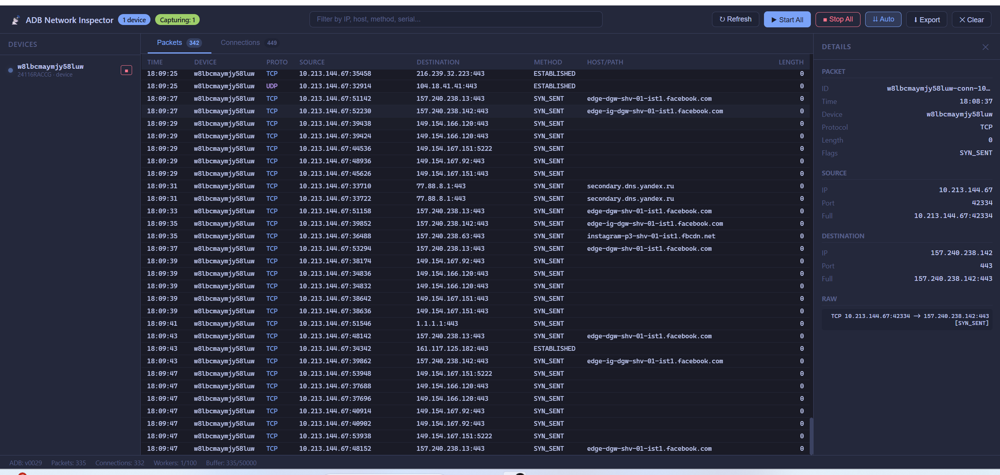
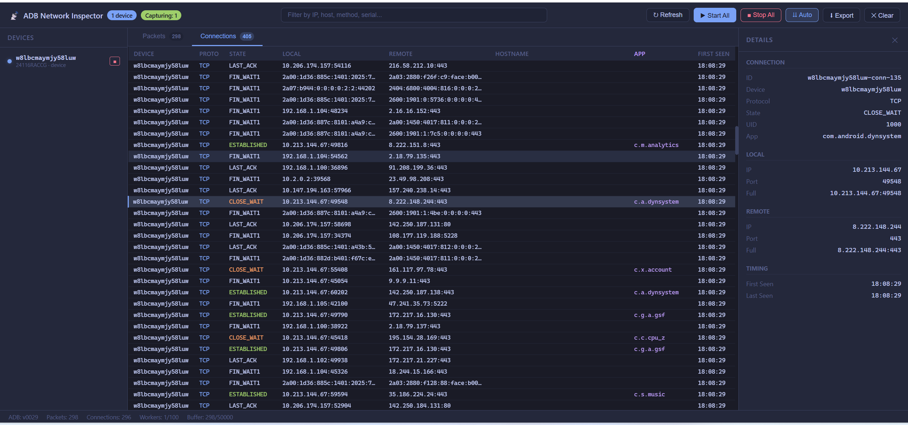

<div align="center">

# 📡 Android ADB Network Inspector

**Real-time network traffic analysis for Android devices — powered by ADB, built in Go.**

A self-contained, zero-dependency web application that monitors every TCP/UDP connection your Android device makes, resolves hostnames via multiple strategies (reverse DNS, logcat DNS snooping, device-side nslookup), identifies which app owns each connection, and captures HTTP URLs from application logs — all streamed live to your browser.

[](https://go.dev)
[](go.mod)
[](LICENSE)
[](https://developer.android.com/tools/adb)

**Created by [@imcanugur](https://github.com/imcanugur)**

</div>

---

<div align="center">

|  |  |
|:---:|:---:|
| *Live packet & connection dashboard* | *Connection details with hostname resolution* |

</div>

---

## Highlights

- **Single binary** — ADB + web UI + server compiled into one executable via `go:embed`. No install, no config, just run it.
- **No root required** — Works with any stock Android device over USB or WiFi. Uses `/proc/net/tcp` for connection tracking.
- **Real-time streaming** — Server-Sent Events push every new packet and connection to the browser instantly.
- **Smart DNS resolution** — 4-layer hostname lookup: local cache → logcat DNS snooping → Go reverse DNS → device-side `nslookup`.
- **App identification** — Maps each connection to its Android app via UID → package name resolution.
- **URL capture from logcat** — Intercepts HTTP URLs logged by OkHttp, Retrofit, Volley, and WebView.
- **Zero external Go dependencies** — Only the standard library. `go.sum` is empty.

---

## Table of Contents

- [Quick Start](#quick-start)
- [How It Works](#how-it-works)
- [Architecture](#architecture)
- [Features](#features)
- [API Reference](#api-reference)
- [Keyboard Shortcuts](#keyboard-shortcuts)
- [Configuration](#configuration)
- [Project Structure](#project-structure)
- [Development](#development)
- [Developer Blog](#developer-blog)
- [FAQ](#faq)

---

## Quick Start

```bash
# Clone
git clone https://github.com/imcanugur/go-adb-monitor.git
cd go-adb-monitor

# Build (embeds ADB + frontend into a single binary)
go build -o adb-monitor .

# Run
./adb-monitor
```

Open **http://localhost:8080** in your browser. Connect an Android device via USB (with USB Debugging enabled), click **▶ Start All**, and watch the traffic flow.

> **Note:** The binary includes an embedded copy of `platform-tools` (ADB). If extraction fails, it falls back to your system's ADB installation.

---

## How It Works

```
┌──────────────────────────────────────────────────────────────────────┐
│                        Android Device (USB/WiFi)                     │
│                                                                      │
│   /proc/net/tcp ──────┐    logcat ──────┐    pm list packages ──┐   │
│   /proc/net/tcp6       │    DNS queries   │    uid → app mapping  │   │
│   /proc/net/udp        │    HTTP URLs     │                       │   │
│   /proc/net/udp6       │    (OkHttp, etc) │                       │   │
└────────┬───────────────┴────────┬─────────┴──────────┬────────────┘
         │ ADB shell                │ ADB shell stream    │ ADB shell
         ▼                          ▼                      ▼
┌──────────────────────────────────────────────────────────────────────┐
│                         Go Server (:8080)                            │
│                                                                      │
│  ┌─ Capture Engine ──────────────────────────────────────────────┐   │
│  │  • ProcNet parser (TCP/UDP state tracking, 2s poll)           │   │
│  │  • Tcpdump parser (if root available)                         │   │
│  │  • Logcat DNS snooper (passive domain→IP mapping)             │   │
│  │  • Logcat URL sniffer (OkHttp/Retrofit/Volley/WebView)        │   │
│  └───────────────────────────┬───────────────────────────────────┘   │
│                               │                                      │
│  ┌─ Resolver ────────────────┼───────────────────────────────────┐   │
│  │  1. Local DNS cache       │  3. Go net.LookupAddr             │   │
│  │  2. Logcat DNS cache      │  4. Device nslookup fallback      │   │
│  │  + UID → package mapper   │                                    │   │
│  └───────────────────────────┼───────────────────────────────────┘   │
│                               ▼                                      │
│  ┌─ Ring Buffer Store ──────────────────────────────────────────┐    │
│  │  50,000 packets + 10,000 connections (circular eviction)      │   │
│  └──────────────┬───────────────────────────────────────────────┘    │
│                  │ SSE broadcast                                     │
│                  ▼                                                    │
│  ┌─ SSE Hub ─── fan-out to all browser tabs ────────────────────┐   │
│  │  256-msg buffer per client, non-blocking                      │   │
│  └───────────────────────────────────────────────────────────────┘   │
└──────────────────────────────────────────────────────────────────────┘
         │
         ▼  EventSource
┌──────────────────────────────────────────────────────────────────────┐
│                        Browser (Vanilla JS)                          │
│  Packets table │ Connections table │ Detail panel │ Live filters     │
└──────────────────────────────────────────────────────────────────────┘
```

### Capture Modes

| Mode | Requires Root | Data Source | What You Get |
|:---|:---:|:---|:---|
| **procnet** (default) | No | `/proc/net/tcp`, `tcp6`, `udp`, `udp6` | All active connections with state, UID, ports |
| **tcpdump** | Yes | `tcpdump -i any` on device | Raw packet data with sizes and flags |
| **logcat snooper** | No | `logcat` stream (runs alongside) | DNS queries → domain names, HTTP URLs from app logs |

The engine auto-detects: if `tcpdump` is available on the device, it uses that; otherwise falls back to procnet. The logcat snooper runs **in parallel** with either mode.

---

## Architecture

```
.
├── main.go                          # Entry point: embed, extract, serve
├── frontend/
│   ├── index.html                   # Dashboard layout
│   └── src/
│       ├── main.js                  # State management, SSE, rendering
│       └── style.css                # Tokyo Night dark theme
└── internal/
    ├── adb/                         # ADB wire protocol client (raw TCP)
    │   ├── client.go                # Connect, shell, list devices
    │   ├── stream.go                # Persistent shell streams (for logcat/tcpdump)
    │   ├── protocol.go              # Hex-length-prefix encoding
    │   ├── device.go                # Device model + parser
    │   └── errors.go                # Typed errors
    ├── adbbin/                      # Embedded ADB binary manager
    │   └── manager.go               # Extract from embed.FS → temp dir
    ├── bridge/                      # HTTP layer
    │   ├── app.go                   # Routes, handlers, orchestration
    │   └── sse.go                   # Server-Sent Events hub (fan-out)
    ├── capture/                     # Network intelligence
    │   ├── engine.go                # Per-device capture orchestrator
    │   ├── procnet.go               # /proc/net/tcp hex parser
    │   ├── tcpdump.go               # tcpdump text output parser
    │   ├── logcat.go                # DNS snooper + URL sniffer
    │   ├── resolver.go              # Multi-strategy hostname + app resolver
    │   └── types.go                 # Packet, Connection, Stats types
    ├── event/                       # Pub/sub event bus
    ├── store/                       # Thread-safe ring buffer
    ├── pool/                        # Bounded worker pool (semaphore)
    ├── tracker/                     # Streaming device tracker (track-devices)
    ├── monitor/                     # Device property collector
    └── logging/                     # Structured slog setup
```

### Key Design Decisions

| Decision | Why |
|:---|:---|
| **Streaming via `track-devices`** | Push-based device detection — ADB server notifies on state change, zero polling latency |
| **Event bus** | Decouples tracker → capture → store → SSE. Clean separation of concerns |
| **Per-device goroutines** | Each device gets independent capture engine + resolver lifecycle |
| **Context-based cancellation** | Signal → server → engines → goroutines — clean cascading shutdown |
| **Exponential backoff reconnect** | Survives ADB server restarts without manual intervention |
| **Ring buffer store** | Bounded memory usage: old packets evicted on overflow, no OOM risk |
| **`go:embed` everything** | Single `cp` to deploy. ADB binary + HTML/CSS/JS all inside the Go binary |
| **Zero dependencies** | No vendor lock-in, no supply chain risk, no `go.sum` churn |

---

## Features

### Network Capture
- **TCP & UDP** connection tracking (ESTABLISHED, SYN_SENT, CLOSE_WAIT, etc.)
- **IPv4 & IPv6** with automatic IPv6-mapped-IPv4 detection (`::ffff:1.2.3.4` → `1.2.3.4`)
- **Per-connection UID** → maps to Android app package name
- Automatic **loopback and LISTEN socket filtering**

### DNS & Hostname Resolution
- **4-layer resolution chain:**
  1. Local in-memory cache
  2. Logcat DNS snooper (captures device's own DNS queries in real-time)
  3. Go standard library reverse DNS (`net.LookupAddr`)
  4. Device-side `nslookup` / `host` command fallback
- **`dumpsys dnsresolver`** cache preload on capture start
- Forward DNS resolution for domains found in logcat

### HTTP URL Intelligence
- Captures URLs from **OkHttp** (`--> POST https://...`), **Retrofit**, **Volley**, **WebView/Chromium** logs
- Extracts **method, host, path** — shown in Packets tab with purple `LC` badge
- Domain→IP correlation from captured URLs

### Web Dashboard
- **Real-time updates** via Server-Sent Events (no polling)
- **Two views:** Packets (network-level) and Connections (socket-level)
- **Live search/filter** across all fields (IP, hostname, app, method, path)
- **Detail panel** with one-click copy buttons on every field
- **Row selection** with keyboard navigation
- **Auto-scroll toggle** for high-traffic monitoring
- **JSON export** of visible data
- **Tab badge counts** for packet and connection totals
- **Toast notifications** for user actions
- **Dark theme** — Tokyo Night color palette

---

## API Reference

All endpoints are served from the built-in HTTP server.

### Devices

| Method | Endpoint | Description |
|:---|:---|:---|
| `GET` | `/api/devices` | List all connected devices |
| `POST` | `/api/devices/refresh` | Force re-scan of devices |
| `GET` | `/api/adb/version` | Get ADB server version |

### Capture Control

| Method | Endpoint | Description |
|:---|:---|:---|
| `POST` | `/api/capture/start-all` | Start capture on all devices |
| `POST` | `/api/capture/stop-all` | Stop all captures |
| `POST` | `/api/capture/start/{serial}` | Start capture on specific device |
| `POST` | `/api/capture/stop/{serial}` | Stop capture on specific device |
| `GET` | `/api/capture/status` | Get capture status for all devices |

### Data

| Method | Endpoint | Description |
|:---|:---|:---|
| `GET` | `/api/packets` | Get recent packets (all devices) |
| `GET` | `/api/packets/{serial}` | Get packets for specific device |
| `GET` | `/api/connections` | Get recent connections (all devices) |
| `GET` | `/api/connections/{serial}` | Get connections for specific device |
| `GET` | `/api/store/stats` | Ring buffer statistics |
| `GET` | `/api/pool/stats` | Worker pool statistics |
| `POST` | `/api/clear` | Clear all stored data |

### Real-time Events

| Method | Endpoint | Description |
|:---|:---|:---|
| `GET` | `/api/events` | SSE stream — `device:connected`, `device:disconnected`, `packet:new`, `connection:new`, `capture:stopped`, `store:updated`, `store:cleared` |

---

## Keyboard Shortcuts

| Key | Action |
|:---|:---|
| `1` | Switch to Packets tab |
| `2` | Switch to Connections tab |
| `Ctrl+K` | Focus search input |
| `Ctrl+J` | Toggle auto-scroll |
| `Ctrl+L` | Clear all data |
| `Esc` | Close detail panel |

---

## Configuration

### CLI Flags

```bash
./adb-monitor -addr :9090   # Listen on a different port
```

| Flag | Default | Description |
|:---|:---:|:---|
| `-addr` | `:8080` | HTTP server listen address |

### Internal Tuning (compile-time)

| Constant | Default | Location |
|:---|:---:|:---|
| `MaxPackets` | 50,000 | `internal/store/` |
| `MaxConnections` | 10,000 | `internal/store/` |
| `MaxWorkers` | 100 | `internal/pool/` |
| `ProcNet poll interval` | 2s | `internal/capture/engine.go` |
| `UID map refresh` | 60s | `internal/capture/resolver.go` |
| `DNS worker concurrency` | 3 | `internal/capture/resolver.go` |
| `SSE buffer per client` | 256 msgs | `internal/bridge/sse.go` |

---

## Project Structure

```
5,300+ lines of Go  •  8 test files  •  0 external dependencies
```

| Package | Lines | Responsibility |
|:---|:---:|:---|
| `adb/` | ~500 | ADB wire protocol — TCP client, shell commands, persistent streams |
| `capture/` | ~1,100 | Network capture engine, procnet/tcpdump parsers, logcat snooper, DNS resolver |
| `bridge/` | ~570 | HTTP handlers, REST API, SSE hub, application lifecycle |
| `store/` | ~290 | Thread-safe dual ring buffer (packets + connections) |
| `tracker/` | ~190 | Streaming device tracker with backoff reconnect |
| `pool/` | ~80 | Bounded concurrency semaphore |
| `event/` | ~100 | Generic pub/sub event bus |
| `frontend/` | ~1,300 | Vanilla JS dashboard (HTML + CSS + JS, no framework) |

---

## Development

### Prerequisites

- **Go 1.22+**
- **ADB** installed (or let the embedded binary handle it)
- An Android device with **USB Debugging** enabled

### Build & Run

```bash
# Development
go run . -addr :8080

# Production build
go build -ldflags="-s -w" -o adb-monitor .

# Run tests
go test ./...

# Vet
go vet ./...
```

### Device Setup

```bash
# Verify device is connected
adb devices

# If device shows "unauthorized", accept the prompt on the device screen

# For WiFi debugging (Android 11+)
adb pair <ip>:<port>
adb connect <ip>:<port>
```

### Adding Platform Tools

The `platform-tools/` directory contains the ADB binary that gets embedded into the final executable. To update it:

```bash
# Download latest platform-tools for your OS
# https://developer.android.com/tools/releases/platform-tools

# Replace the directory
rm -rf platform-tools/
unzip platform-tools_rXX.X.X-linux.zip
```

---

## FAQ

<details>
<summary><b>Why can't I see HTTP request URLs for HTTPS traffic?</b></summary>

HTTPS traffic is encrypted — the actual URL paths are not visible from the network layer. However, this tool uses **logcat DNS snooping** to capture which domains your device connects to, and **logcat URL sniffing** to capture HTTP URLs that apps write to their logs (OkHttp, Retrofit, etc. in debug builds). For production apps with logging disabled, you'll see the resolved hostname but not the full URL path.
</details>

<details>
<summary><b>Does this require root access on the device?</b></summary>

No. The default `procnet` mode reads `/proc/net/tcp` which is accessible without root. If your device is rooted and has `tcpdump` installed, the tool will automatically use it for more detailed packet capture.
</details>

<details>
<summary><b>How does hostname resolution work without seeing DNS packets?</b></summary>

Four strategies work together:
1. **Logcat DNS snooper** — streams the device's logcat, captures DNS resolution events (DnsResolver, netd tags)
2. **dumpsys dnsresolver** — reads the device's DNS cache on startup
3. **Reverse DNS** — Go's `net.LookupAddr` on the captured IPs
4. **Device nslookup** — runs `nslookup`/`host` directly on the Android device as a fallback
</details>

<details>
<summary><b>Can I monitor multiple devices at once?</b></summary>

Yes. Each connected device gets its own capture engine, resolver, and logcat snooper running independently. The dashboard shows data from all devices with device serial in each row.
</details>

<details>
<summary><b>Why zero external dependencies?</b></summary>

By design. The Go standard library provides everything needed: HTTP server, JSON encoding, TCP sockets, DNS resolution, file embedding, structured logging. No supply chain risk, no version conflicts, no `go mod tidy` drama.
</details>

<details>
<summary><b>How much memory does it use?</b></summary>

Memory is bounded by the ring buffer sizes: 50K packets + 10K connections. Old entries are evicted automatically. Typical usage is 30–80 MB depending on traffic volume.
</details>

---

## Developer Blog

### The "Why" — How This Project Started

The goal was simple: **one binary, zero setup, real-time results.**

### Chapter 1: The ADB Wire Protocol Rabbit Hole

The first decision was to **not shell out** to the `adb` CLI. Instead, I implemented the ADB wire protocol directly over TCP. ADB uses a straightforward hex-length-prefix protocol:

```
Client sends:   "000Chost:version"
Server replies: "OKAY" + hex-length + payload
```

This unlocked persistent streaming connections — critical for `track-devices` (push-based device detection) and long-running `shell` sessions for logcat/tcpdump.

The `OpenShellStream()` function returns an `io.Reader` over a persistent TCP connection to the device. This is the foundation for both tcpdump and logcat streaming — the same pattern, different commands.

### Chapter 2: The `/proc/net/tcp` Parser

Most Android devices aren't rooted, so `tcpdump` isn't available. But every Linux device (including Android) exposes active TCP/UDP sockets via `/proc/net/tcp`.

The catch: it's in hex.

```
sl  local_address rem_address   st tx_queue rx_queue ...
 0: 0100007F:13AD 00000000:0000 0A 00000000:00000000 ...
```

Local address `0100007F:13AD` means `127.0.0.1:5037` (bytes reversed). TCP state `0A` means LISTEN. I wrote a full parser that handles IPv4, IPv6, IPv6-mapped-IPv4 addresses (`::ffff:1.2.3.4` → just `1.2.3.4`), and all 11 TCP states.

The engine polls these files every 2 seconds and diffs against the known set — new connections are emitted as events.

### Chapter 3: The DNS Problem

Once I had connections showing up, the next frustration was: **"What is `142.250.187.206`?"** — knowing the IP isn't useful, I need the domain name.

Reverse DNS (`net.LookupAddr`) sounds like the answer, but most IPs don't have PTR records. Google's IPs do, but 80% of the internet doesn't.

So I built a 4-layer resolution chain:

1. **Logcat DNS snooper** — stream the device's logcat and parse DNS resolution log lines. When Chrome resolves `api.github.com`, Android's `DnsResolver` tag logs it. I capture that domain→IP mapping.

2. **`dumpsys dnsresolver`** — on capture start, dump the device's existing DNS cache. This catches domains resolved before we started listening.

3. **Go reverse DNS** — standard `net.LookupAddr` as a fallback. Works for big providers.

4. **Device-side `nslookup`** — if all else fails, run `nslookup` on the Android device itself. It may have cached the forward lookup.

The logcat snooper was the breakthrough. It runs alongside the main capture and passively builds a domain→IP map from the device's own DNS queries. No root needed, no traffic interception, no proxy.

### Chapter 4: "Which App Is Making This Request?"

Linux associates sockets with user IDs (UIDs). On Android, each app gets a unique UID. `/proc/net/tcp` exposes the UID for each socket.

So: read UID from `/proc/net/tcp` → run `pm list packages -U` on device → map UID to package name → now you see `com.instagram.android` instead of `10156`.

The UID map refreshes every 60 seconds to catch newly installed apps.

### Chapter 5: URL Intelligence From Logcat

The logcat snooper does more than DNS. Many Android networking libraries **log HTTP requests**:

- **OkHttp**: `--> POST https://api.example.com/v1/users`
- **Retrofit**: Logs request/response when logging interceptor is enabled
- **Volley**: Logs request URLs
- **WebView/Chromium**: Logs navigation and resource loads

I added regex patterns to extract method + URL from these log lines. When found, they're emitted as NetworkPacket events with the `logcat:` prefix in flags, and shown with a purple **LC** badge in the UI.

This means for debug builds of apps, you get **full HTTP URLs with paths** — not just IP addresses.

### Chapter 6: Zero Dependencies — A Conscious Choice

The `go.sum` file is empty. This wasn't laziness, it was intentional:

- **`net/http`** is a production-grade HTTP server
- **`encoding/json`** handles all serialization
- **`embed`** bundles static files into the binary
- **`log/slog`** provides structured logging (Go 1.21+)
- **`net`** has DNS resolution built in
- **Server-Sent Events** are just `text/event-stream` responses — no library needed

The result: `go build` produces a single binary. No `node_modules`, no `vendor/`, no dependency management. Copy the binary to any machine with USB/ADB access and it works.

### Chapter 7: The Single Binary Trick

The `go:embed` directive made the "single binary" dream real:

```go
//go:embed frontend
var frontendFS embed.FS

//go:embed platform-tools
var platformToolsFS embed.FS
```

The **ADB binary itself** (21 MB) is embedded in the Go binary. On startup, it's extracted to a temp directory with the right permissions. The frontend (HTML/CSS/JS) is served directly from `embed.FS`.

The output is one file. `scp` it anywhere, run it, open a browser. Done.

### Lessons Learned

| Lesson | Detail |
|:---|:---|
| **Streaming beats polling** | `track-devices` and SSE are fundamentally better than poll loops. Lower latency, less CPU, simpler code. |
| **The kernel knows everything** | `/proc/net/tcp` is an underrated data source. No root, no special permissions, real-time socket state. |
| **Logcat is a goldmine** | Apps log way more than you'd think. DNS queries, HTTP URLs, connection events — it's all there. |
| **Ring buffers solve memory** | Unbounded append lists are a memory leak waiting to happen. Fixed-size ring buffers with eviction = predictable memory. |
| **`go:embed` changes deployment** | Embedding assets into the binary eliminates an entire class of deployment problems. |
| **Zero deps is freeing** | No CVE emails, no breaking changes from upstream, no compatibility matrix. Just `go build`. |

### What's Next

- [ ] **HAR export** — Export captured traffic as HTTP Archive format for import into Chrome DevTools
- [ ] **mTLS inspection** — For rooted devices, intercept TLS with a custom CA
- [ ] **Wireshark integration** — Export as PCAP for deep packet analysis
- [ ] **Device-side DNS interception** — Hook into `libc` DNS resolution via `LD_PRELOAD` on rooted devices
- [ ] **Bandwidth graphs** — Per-app and per-domain traffic volume over time
- [ ] **Connection timeline** — Visual timeline of connection open/close events

---

## Author

<table>
  <tr>
    <td align="center">
      <a href="https://github.com/imcanugur">
        
        <br />
        <b>Can Uğur</b>
      </a>
      <br />
      <a href="https://github.com/imcanugur">@imcanugur</a>
      <br />
      <sub>Creator & Maintainer</sub>
    </td>
  </tr>
</table>

- 💻 GitHub: [github.com/imcanugur](https://github.com/imcanugur)
- 📦 Project: [go-adb-monitor](https://github.com/imcanugur/go-adb-monitor)

Contributions, issues, and feature requests are welcome! Feel free to open an [issue](https://github.com/imcanugur/go-adb-monitor/issues) or submit a pull request.

If you found this project useful, consider giving it a ⭐ on GitHub!

---

## License

MIT © [Can Uğur](https://github.com/imcanugur)

---

<div align="center">
<sub>Built with nothing but Go standard library, curiosity, and a lot of hexadecimal parsing.</sub>
<br />
<sub>Made with ❤️ by <a href="https://github.com/imcanugur">@imcanugur</a></sub>
</div>
